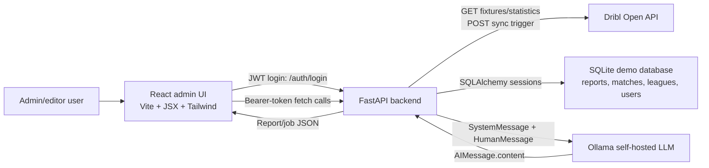
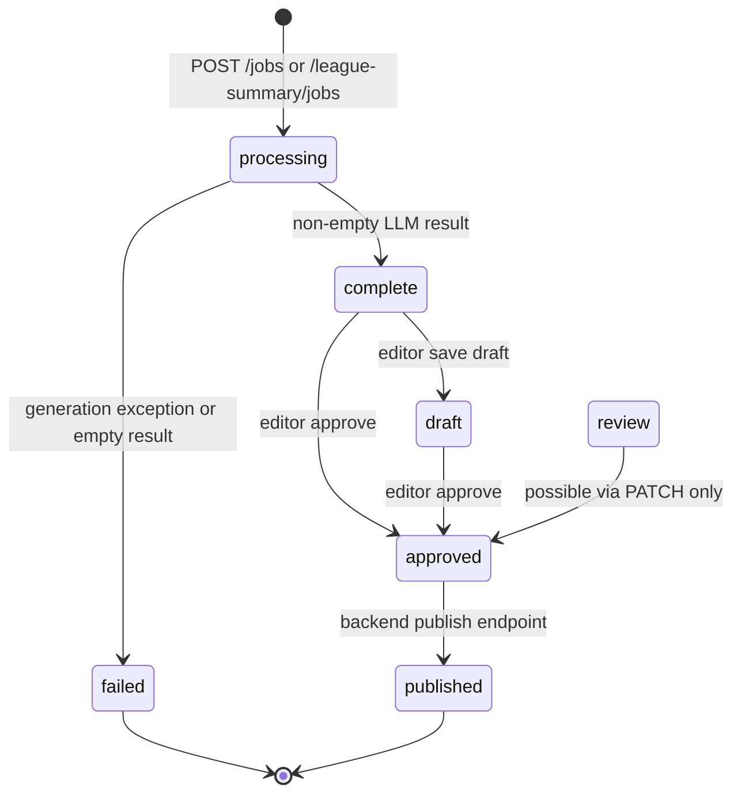

# Reporta AI Handover Report

Project: Reporta AI - AI-Powered Football Match Report Microservice  
Client: Dribl 
Client representative/supervisor: Chris Boulamatsis 
Academic context: INFO6002 Postgraduate Capstone Project (PCP-AUT2606), Autumn 2026  
Author: PCP-AUT2606 
Document date: 11 June 2026  
Document version: 3.3  
Repository snapshot reviewed: `PCP-AUT2606` at commit `8cd357bb45d8cfc8db92f42e165d7e2ba805b28c`

## 1. Executive Summary

Reporta AI is a React/FastAPI application for generating football match reports and league/round summaries from Dribl fixture data. The system supports authenticated admin users, syncing fixture data from Dribl into a local database, browsing matches and leagues, creating asynchronous LLM generation jobs through Ollama, and reviewing generated reports before approval or publication. The README describes the current demo as React + Vite, FastAPI, SQLite, and local Ollama using `qwen3:14b` (`README.md:3`, `README.md:5`)

The current codebase is a working demo/admin console rather than a fully productionised Dribl microservice. Core backend flows exist for Dribl sync, match/league browsing, report generation, persistence, draft/approve/publish/delete status transitions, and dashboard counts. Known gaps remain around production database alignment, audit/version history, frontend publish support, formal service-layer separation in the frontend, mixed markdown/HTML storage of report content, and documented infrastructure details such as GPU/model benchmarking. LangSmith was used during development for log analysis and was deliberately removed from the final version for data sovereignty; this repository snapshot contains no LangSmith dependency, tracing code, or required LangSmith environment variables.

## 2. System Architecture Overview

The system is organised into three practical layers:

1. Dribl API data layer: `backend/app/services/dribl.py` calls `https://open.dribl.com/api` with `DRIBL_TOKEN` and exposes fixture, fixture statistics, fixture list, and derived league helper functions (`backend/app/services/dribl.py:11`, `backend/app/services/dribl.py:12`, `backend/app/services/dribl.py:50`, `backend/app/services/dribl.py:55`, `backend/app/services/dribl.py:71`, `backend/app/services/dribl.py:106`).
2. FastAPI processing layer: `backend/app/main.py` defines authentication, sync, dashboard, match, league, report, job, and generation endpoints. It persists data via SQLAlchemy models in `backend/app/models.py` and uses Ollama through `backend/app/services/ollama.py` (`backend/app/main.py:57`, `backend/app/models.py:12`, `backend/app/models.py:50`, `backend/app/models.py:80`, `backend/app/models.py:99`, `backend/app/services/ollama.py:19`).
3. React admin UI presentation layer: `frontend/src/App.jsx` defines protected routes for dashboard, matches, leagues, jobs, and generated report review (`frontend/src/App.jsx:15`, `frontend/src/App.jsx:17`, `frontend/src/App.jsx:18`, `frontend/src/App.jsx:21`, `frontend/src/App.jsx:25`).




Important communication details:

- The frontend reads `VITE_API_BASE_URL`, defaulting to `http://127.0.0.1:8000` in multiple pages/components (`frontend/.env.example:1`, `frontend/src/pages/Login.jsx:15`, `frontend/src/pages/Matches.jsx:486`, `frontend/src/components/MatchReportModal.jsx:12`).
- API calls are made directly with `fetch`, generally adding a bearer token from `localStorage` (`frontend/src/utils/auth.js:1`, `frontend/src/utils/auth.js:12`, `frontend/src/components/ProtectedRoute.jsx:4`, `frontend/src/components/ProtectedRoute.jsx:5`).
- FastAPI protects most routes with `HTTPBearer` and JWT validation (`backend/app/main.py:77`, `backend/app/main.py:78`, `backend/app/main.py:162`, `backend/app/main.py:166`).
- LLM generation uses `ChatOllama`, with Langchain assembling optional `SystemMessage` plus `HumanMessage`, then returning `response.content` (`backend/app/services/ollama.py:8`, `backend/app/services/ollama.py:9`, `backend/app/services/ollama.py:27`, `backend/app/services/ollama.py:34`, `backend/app/services/ollama.py:44`, `backend/app/services/ollama.py:49`).

### End-to-End Runtime Flow

The intended runtime sequence is:

1. An admin logs in through `/auth/login`. The frontend stores the returned JWT under `reporta_token` in `localStorage` (`frontend/src/pages/Login.jsx:57`, `frontend/src/pages/Login.jsx:75`, `frontend/src/utils/auth.js:1`, `frontend/src/utils/auth.js:12`).
2. The dashboard can trigger `POST /sync/dribl`, which crawls Dribl fixture pages and stores a local cache of matches and derived leagues (`frontend/src/pages/Dashboard.jsx:203`, `frontend/src/pages/Dashboard.jsx:211`, `backend/app/main.py:1122`, `backend/app/services/dribl_sync.py:338`).
3. The Matches and Leagues pages read from the backend database cache, not directly from Dribl in the browser (`frontend/src/pages/Matches.jsx:486`, `frontend/src/pages/Leagues.jsx:117`, `backend/app/main.py:1224`, `backend/app/main.py:1301`).
4. A generation modal creates a background job. The backend immediately stores a `Report` row with `status="processing"` and returns the new `report_id` (`frontend/src/components/MatchReportModal.jsx:145`, `frontend/src/components/LeagueSummaryModal.jsx:122`, `backend/app/main.py:775`, `backend/app/main.py:798`, `backend/app/main.py:870`, `backend/app/main.py:888`).
5. The Jobs page polls `/reports` every three seconds while processing jobs exist (`frontend/src/pages/Jobs.jsx:301`, `frontend/src/pages/Jobs.jsx:305`, `frontend/src/pages/Jobs.jsx:306`).
6. The background task updates the same `Report` row to `complete` on success or `failed` on exception (`backend/app/main.py:607`, `backend/app/main.py:609`, `backend/app/main.py:623`, `backend/app/main.py:627`).
7. Completed reports open in `/report/result`, where the user can edit, save draft, approve, or delete (`frontend/src/pages/Jobs.jsx:341`, `frontend/src/pages/Jobs.jsx:345`, `frontend/src/pages/GeneratedReport.jsx:454`, `frontend/src/pages/GeneratedReport.jsx:485`, `frontend/src/pages/GeneratedReport.jsx:516`).

### Data Sovereignty Boundary

The application code does not call any cloud LLM provider. Generation is routed to the configured Ollama server via `OLLAMA_URL` (`backend/app/services/ollama.py:13`, `backend/app/services/ollama.py:27`). This is consistent with the stated data sovereignty requirement if the FastAPI backend, database, Ollama runtime, and any logs/traces all run inside Dribl-controlled infrastructure. The code does print prompts and responses to stdout during generation (`backend/app/services/ollama.py:39`, `backend/app/services/ollama.py:41`, `backend/app/services/ollama.py:45`), so operational logging must also be treated as sensitive match/report data. LangSmith was used during development for log analysis but was deliberately removed from the final version specifically because external tracing would send prompt/response data outside Dribl-controlled infrastructure; no committed code or dependency enables it in this snapshot. If tracing is reintroduced, it must be self-hosted or otherwise approved under Dribl data-sovereignty requirements.

## 3. Repository Structure

```text
PCP-AUT2606/
  README.md                         Project overview, setup, current demo URLs and workflow.
  package.json                      Root dev dependency only: Prettier.
  backend/
    requirements.txt                Python dependencies.
    app.db                          Local SQLite database file, ignored by git.
    .env                            Local environment file, ignored by git.
    app/
      main.py                       FastAPI app, auth, endpoints, job lifecycle.
      db.py                         SQLAlchemy engine/session setup.
      models.py                     Report, Match, League, User ORM models.
      schemas.py                    Pydantic schemas for synchronous generation.
      create_user.py                Demo/admin user seeding script.
      services/
        dribl.py                    Dribl API client.
        dribl_sync.py               Fixture sync and league derivation.
        dribl_normalize.py          Dribl fixture/statistics to report-ready shape.
        round_summary_builder.py    League/round summary payload builder.
        prompts.py                  Prompt templates and prompt assembly.
        ollama.py                   Ollama/LangChain integration.
        report_style_options.py     Tone/excitement/comedy option handling.
  frontend/
    package.json                    React/Vite/Tailwind/lucide/Quill dependencies.
    .env.example                    Frontend API base URL key.
    vite.config.js                  Vite dev server port 5173.
    tailwind.config.js              Tailwind content paths.
    postcss.config.js               Tailwind/PostCSS configuration.
    public/samples/                 Sample fixture/statistics/report-ready JSON payloads.
    src/
      App.jsx                       Router and protected route layout.
      main.jsx                      React entrypoint.
      global.css                    Global styles and Tailwind imports.
      layouts/MainLayout.jsx        Sidebar shell and responsive layout.
      components/                   Sidebar, route guard, match/league generation modals.
      pages/                        Login, dashboard, matches, leagues, jobs, generated report editor.
      utils/                        Auth helpers and report title helpers.
  docs/
    HANDOVER_REPORT.md              This handover report (commit the latest version; current document version 3.1).
```

Dependency observations:

- Frontend dependencies include React, Vite, Tailwind CSS, React Router v6, clsx, lucide-react, plus `marked`, `quill`, and `react-quill` (`frontend/package.json:11`, `frontend/package.json:15`, `frontend/package.json:16`, `frontend/package.json:18`, `frontend/package.json:21`, `frontend/package.json:22`, `frontend/package.json:23`, `frontend/package.json:24`).
- Backend dependencies include FastAPI, SQLAlchemy, Pydantic, python-dotenv, python-jose, passlib/bcrypt, curl_cffi, requests, uvicorn, and `langchain-ollama` (`backend/requirements.txt:10`, `backend/requirements.txt:12`, `backend/requirements.txt:21`, `backend/requirements.txt:24`, `backend/requirements.txt:25`, `backend/requirements.txt:30`, `backend/requirements.txt:35`, `backend/requirements.txt:36`).

### Important Files for Future Developers


| File                                      | Why it matters                                                                                                                                                                                                                                  |
| ----------------------------------------- | ----------------------------------------------------------------------------------------------------------------------------------------------------------------------------------------------------------------------------------------------- |
| `backend/app/main.py`                     | Main API surface and most business workflow logic. Endpoint changes will usually start here.                                                                                                                                                    |
| `backend/app/services/dribl.py`           | Lowest-level Dribl API access; change this first if Dribl auth, base URLs, or request parameters change.                                                                                                                                        |
| `backend/app/services/dribl_sync.py`      | Converts paginated Dribl fixtures into local `Match` rows and derived `League` rows.                                                                                                                                                            |
| `backend/app/services/dribl_normalize.py` | Converts inconsistent fixture/statistics shapes into the report-facing `match_data` object.                                                                                                                                                     |
| `backend/app/services/prompts.py`         | Main prompt engineering surface. It controls output structure, anti-hallucination rules, report-type behavior, the JSON-to-readable-text conversion, and the round-summary H/A abbreviation convention (see Section 4, Prompt data formatting). |
| `backend/app/services/ollama.py`          | LLM runtime adapter. Model, context size, and thinking/reasoning behavior enter here.                                                                                                                                                           |
| `frontend/src/pages/Matches.jsx`          | Match browser, filters, pagination, and entry point to match report generation.                                                                                                                                                                 |
| `frontend/src/pages/Leagues.jsx`          | League list and entry point to league summary generation.                                                                                                                                                                                       |
| `frontend/src/pages/Jobs.jsx`             | Job/status monitor and navigation into completed report review.                                                                                                                                                                                 |
| `frontend/src/pages/GeneratedReport.jsx`  | Editor workflow, markdown conversion, draft/approve/delete calls.                                                                                                                                                                               |


## 4. Backend Handover

### FastAPI App Structure

`backend/app/main.py` creates tables on startup using `Base.metadata.create_all(bind=engine)` and then performs a SQLite-specific migration helper to ensure score columns exist on `matches` (`backend/app/main.py:32`, `backend/app/main.py:33`, `backend/app/main.py:36`, `backend/app/main.py:55`). CORS is permissive for the demo with `allow_origins=["*"]` (`backend/app/main.py:59`, `backend/app/main.py:62`).

Authentication is JWT-based. `SECRET_KEY` is required at startup, tokens use HS256 and expire after 60 minutes (`backend/app/main.py:70`, `backend/app/main.py:72`, `backend/app/main.py:74`, `backend/app/main.py:75`, `backend/app/main.py:698`, `backend/app/main.py:703`).

The database models are:


| Model    | Table     | Purpose                                              | Key fields                                                                                                                                                                                                                                                        |
| -------- | --------- | ---------------------------------------------------- | ----------------------------------------------------------------------------------------------------------------------------------------------------------------------------------------------------------------------------------------------------------------- |
| `Report` | `reports` | Generated report/job persistence                     | `fixture_id`, `report_type`, `tone`, `source_data`, `content`, `status`, timestamps (`backend/app/models.py:12`, `backend/app/models.py:19`, `backend/app/models.py:22`, `backend/app/models.py:28`, `backend/app/models.py:31`, `backend/app/models.py:34`)      |
| `Match`  | `matches` | Synced Dribl fixtures and denormalised browse fields | `fixture_id`, teams, dates, venue, status, score, `raw_json` (`backend/app/models.py:50`, `backend/app/models.py:55`, `backend/app/models.py:61`, `backend/app/models.py:65`, `backend/app/models.py:70`, `backend/app/models.py:73`, `backend/app/models.py:76`) |
| `League` | `leagues` | League rows derived from synced matches              | `league_id`, name, competition, season, tenant, rounds, status (`backend/app/models.py:80`, `backend/app/models.py:83`, `backend/app/models.py:85`, `backend/app/models.py:86`, `backend/app/models.py:93`, `backend/app/models.py:94`)                           |
| `User`   | `users`   | Login users                                          | `username`, `password_hash`, `role` (`backend/app/models.py:99`, `backend/app/models.py:106`, `backend/app/models.py:109`, `backend/app/models.py:112`)                                                                                                           |


Model behavior notes:

- `Report.source_data` is stored as JSON text rather than a JSON column. `serialize_report` attempts `json.loads` and returns `None` if parsing fails (`backend/app/main.py:131`, `backend/app/main.py:135`, `backend/app/main.py:137`, `backend/app/main.py:139`).
- `Match.raw_json` preserves the original Dribl payload. `serialize_match` rehydrates it and overlays denormalised database fields such as team names, dates, event status, and scores (`backend/app/main.py:293`, `backend/app/main.py:297`, `backend/app/main.py:311`, `backend/app/main.py:336`).
- `League` rows are not fetched from a Dribl league endpoint in the current sync flow. They are rebuilt from `Match` rows by `_derive_leagues` (`backend/app/models.py:83`, `backend/app/services/dribl_sync.py:271`, `backend/app/services/dribl_sync.py:401`).
- `User.role` exists in the model, but endpoint authorization currently checks only whether the JWT is valid; there is no role-based access control in `get_current_user` (`backend/app/models.py:112`, `backend/app/main.py:162`, `backend/app/main.py:172`).

### Backend Request/Response Shapes

The following examples are representative shapes based on the Pydantic models and serializer functions. They are not generated from OpenAPI at runtime, but they match the current code paths.

Login request:

```json
{
  "username": "admin@example.com",
  "password": "password"
}
```

Login response:

```json
{
  "access_token": "<jwt>",
  "token_type": "bearer"
}
```

Create match report job request:

```json
{
  "fixture_id": "12345",
  "report_type": "post_match",
  "tone": "professional",
  "excitement": "balanced",
  "comedic_effect": "none"
}
```

Create job response:

```json
{
  "job_status": "processing",
  "report_status": "processing",
  "report_id": 42,
  "report": null
}
```

Duplicate processing job response:

```json
{
  "job_status": "processing",
  "report_status": "processing",
  "report_id": 42,
  "report": null,
  "duplicate": true,
  "message": "A matching report is already being generated."
}
```

Report serializer shape:

```json
{
  "id": 42,
  "fixture_id": "12345",
  "report_type": "post_match",
  "tone": "professional",
  "source_data": {},
  "content": "...",
  "status": "complete",
  "created_at": "2026-06-10T00:00:00",
  "updated_at": "2026-06-10T00:00:00"
}
```

League summary job request:

```json
{
  "league_id": "league-123",
  "league_name": "Example League",
  "competition": "Example Competition",
  "season": "Winter 2026",
  "round": "all",
  "round_label": "All rounds",
  "tone": "professional",
  "excitement": "balanced",
  "comedic_effect": "none"
}
```

### Key Endpoints

Most endpoints except `/health` and `/auth/login` require bearer JWT authentication.


| Method   | Path                                      | Purpose                                              | Request shape                                                                                                                        | Response shape / notes                                                                                                                                                          |
| -------- | ----------------------------------------- | ---------------------------------------------------- | ------------------------------------------------------------------------------------------------------------------------------------ | ------------------------------------------------------------------------------------------------------------------------------------------------------------------------------- |
| `GET`    | `/health`                                 | Basic health check                                   | None                                                                                                                                 | `{"status":"ok"}` (`backend/app/main.py:676`)                                                                                                                                   |
| `POST`   | `/auth/login`                             | Login and return JWT                                 | `{username, password}` (`backend/app/main.py:81`)                                                                                    | `{access_token, token_type}` (`backend/app/main.py:686`, `backend/app/main.py:705`)                                                                                             |
| `GET`    | `/report-style-options`                   | Return tone/excitement/comedy options                | Bearer token                                                                                                                         | `{tones, excitement_levels, comedic_effects}` from style service (`backend/app/main.py:681`, `backend/app/services/report_style_options.py:163`)                                |
| `GET`    | `/dashboard`                              | Aggregate match, league, job, content/status counts  | Bearer token                                                                                                                         | `stats`, `last_dribl_sync_at`, recent reports (`backend/app/main.py:1130`, `backend/app/main.py:1191`)                                                                          |
| `POST`   | `/sync/dribl`                             | Pull Dribl fixtures into local DB and derive leagues | Bearer token                                                                                                                         | Sync counts and timestamp (`backend/app/main.py:1122`, `backend/app/services/dribl_sync.py:338`, `backend/app/services/dribl_sync.py:414`)                                      |
| `GET`    | `/matches`                                | Paginated match list from local sync cache           | Query: `start_date`, `end_date`, `status`, `search`, `sort`, `page`                                                                  | `{data, meta, links}` (`backend/app/main.py:1213`, `backend/app/main.py:1280`)                                                                                                  |
| `GET`    | `/matches/{fixture_id}`                   | Build report-ready match bundle                      | Path fixture ID                                                                                                                      | `{fixture_id, fixture, statistics, match_data}` (`backend/app/main.py:708`, `backend/app/main.py:263`, `backend/app/main.py:285`)                                               |
| `GET`    | `/leagues`                                | List derived leagues from local DB                   | Query: `tenant_name`, `start_date`, `end_date`, `status`                                                                             | `{data,total}` (`backend/app/main.py:1292`, `backend/app/main.py:1320`)                                                                                                         |
| `GET`    | `/leagues/{league_id}/round-summary-data` | Build structured round summary payload               | Path league ID, query `round`                                                                                                        | Round payload with matches, counts, notes (`backend/app/main.py:806`, `backend/app/services/round_summary_builder.py:84`, `backend/app/services/round_summary_builder.py:156`)  |
| `POST`   | `/jobs`                                   | Create async match report job                        | `JobRequest`: `fixture_id`, `report_type`, tone/excitement/comedy, optional fixture/statistics/match_data (`backend/app/main.py:86`) | Processing job with `report_id`; background task starts generation (`backend/app/main.py:717`, `backend/app/main.py:775`, `backend/app/main.py:788`, `backend/app/main.py:798`) |
| `POST`   | `/league-summary/jobs`                    | Create async league/round summary job                | `LeagueSummaryJobRequest`: league details, round, status, style (`backend/app/main.py:97`)                                           | Processing job with `report_id`; background task starts generation (`backend/app/main.py:829`, `backend/app/main.py:870`, `backend/app/main.py:883`, `backend/app/main.py:888`) |
| `GET`    | `/reports`                                | List all report/job rows                             | Bearer token                                                                                                                         | `{data,total}` (`backend/app/main.py:896`, `backend/app/main.py:903`)                                                                                                           |
| `POST`   | `/reports`                                | Manually create a report row                         | `ReportCreate`: optional fixture, report_type, tone, source_data, content, status (`backend/app/main.py:116`)                        | Serialized report (`backend/app/main.py:909`, `backend/app/main.py:928`)                                                                                                        |
| `GET`    | `/reports/published`                      | List published reports only                          | Bearer token                                                                                                                         | `{data,total}` (`backend/app/main.py:931`, `backend/app/main.py:943`)                                                                                                           |
| `POST`   | `/reports/generate`                       | Synchronous generation endpoint                      | `GenerateReportRequest`: report_type, tone, excitement, comedic_effect, match_data (`backend/app/schemas.py:7`)                      | `GenerateReportResponse` (`backend/app/main.py:950`, `backend/app/schemas.py:22`)                                                                                               |
| `GET`    | `/reports/{report_id}`                    | Fetch one report                                     | Path ID                                                                                                                              | Serialized report or 404 (`backend/app/main.py:985`)                                                                                                                            |
| `PUT`    | `/reports/{report_id}`                    | Replace content and force draft status               | `{content}` (`backend/app/main.py:112`)                                                                                              | Serialized report (`backend/app/main.py:999`, `backend/app/main.py:1011`)                                                                                                       |
| `PATCH`  | `/reports/{report_id}`                    | Update content/source_data/status                    | Optional `{content,status,source_data}` (`backend/app/main.py:125`)                                                                  | Validates status against known states (`backend/app/main.py:1020`, `backend/app/main.py:1038`, `backend/app/main.py:1040`)                                                      |
| `POST`   | `/reports/{report_id}/approve`            | Mark report approved                                 | Path ID                                                                                                                              | Serialized report (`backend/app/main.py:1061`, `backend/app/main.py:1072`)                                                                                                      |
| `POST`   | `/reports/{report_id}/publish`            | Mark approved report published                       | Path ID                                                                                                                              | Requires current status `approved` (`backend/app/main.py:1080`, `backend/app/main.py:1091`, `backend/app/main.py:1097`)                                                         |
| `DELETE` | `/reports/{report_id}`                    | Delete report row                                    | Path ID                                                                                                                              | `{"message":"Deleted"}` (`backend/app/main.py:1105`, `backend/app/main.py:1119`)                                                                                                |


Endpoint implementation notes:

- `/jobs` checks for duplicate in-progress jobs for the same fixture, report type, and style before creating a new row (`backend/app/main.py:397`, `backend/app/main.py:418`, `backend/app/main.py:727`, `backend/app/main.py:734`).
- `/league-summary/jobs` checks for duplicate in-progress jobs for the same league and round, but not tone/excitement/comedy (`backend/app/main.py:424`, `backend/app/main.py:447`, `backend/app/main.py:842`).
- `/matches` uses a fixed page size of 50 and clamps page numbers into the valid range (`backend/app/main.py:1225`, `backend/app/main.py:1226`, `backend/app/main.py:1253`, `backend/app/main.py:1254`).
- `/reports/{report_id}/publish` enforces the transition from `approved` to `published`; direct publication from `complete`, `draft`, or `review` is rejected (`backend/app/main.py:1091`, `backend/app/main.py:1092`, `backend/app/main.py:1097`).
- `/sync/dribl` is synchronous from the HTTP caller's perspective. It can take time because it paginates fixtures and may request detail data per fixture (`backend/app/services/dribl_sync.py:347`, `backend/app/services/dribl_sync.py:367`, `backend/app/services/dribl_sync.py:399`).

### Dribl Sync and Normalisation Details

Dribl API client behavior:

- `BASE_URL` is fixed to `https://open.dribl.com/api` (`backend/app/services/dribl.py:11`).
- Requests include bearer auth from `DRIBL_TOKEN`, `Accept: */*`, and a Thunder Client user agent (`backend/app/services/dribl.py:12`, `backend/app/services/dribl.py:15`, `backend/app/services/dribl.py:18`).
- `curl_cffi.requests.get` uses `impersonate="chrome"`, which is a deliberate compatibility choice for Dribl access (`backend/app/services/dribl.py:5`, `backend/app/services/dribl.py:27`, `backend/app/services/dribl.py:33`).
- Connection failures become HTTP 503 with a user-readable message; non-200 responses pass through the Dribl status code and response text (`backend/app/services/dribl.py:35`, `backend/app/services/dribl.py:37`, `backend/app/services/dribl.py:41`, `backend/app/services/dribl.py:43`).

Sync process:

1. `sync_dribl_data` starts from page 1 and calls `get_fixtures(start_date="2020-01-01", page=page)` (`backend/app/services/dribl_sync.py:338`, `backend/app/services/dribl_sync.py:349`).
2. For each fixture, it extracts attributes and fixture ID using helper functions that tolerate nested/wrapped Dribl shapes (`backend/app/services/dribl_sync.py:139`, `backend/app/services/dribl_sync.py:145`, `backend/app/services/dribl_sync.py:182`).
3. It attempts to fetch each fixture detail record via `get_fixture(fixture_id)` and counts failures without aborting the whole sync (`backend/app/services/dribl_sync.py:365`, `backend/app/services/dribl_sync.py:367`, `backend/app/services/dribl_sync.py:369`, `backend/app/services/dribl_sync.py:370`).
4. It upserts `Match` rows by `fixture_id` and writes denormalised fields plus `raw_json` (`backend/app/services/dribl_sync.py:375`, `backend/app/services/dribl_sync.py:382`, `backend/app/services/dribl_sync.py:386`, `backend/app/services/dribl_sync.py:267`).
5. After all pages are processed, `_derive_leagues` rebuilds league rows from all matches and commits (`backend/app/services/dribl_sync.py:392`, `backend/app/services/dribl_sync.py:396`, `backend/app/services/dribl_sync.py:401`, `backend/app/services/dribl_sync.py:402`).

Report normalisation:

- `normalize_fixture_for_report` creates the common report-facing payload with fixture ID, tenant, report type, competition, league, season, round, date/time, venue/field, event status, home/away teams, scores, goals, cards, referees, and notes (`backend/app/services/dribl_normalize.py:201`, `backend/app/services/dribl_normalize.py:216`, `backend/app/services/dribl_normalize.py:230`, `backend/app/services/dribl_normalize.py:235`, `backend/app/services/dribl_normalize.py:240`, `backend/app/services/dribl_normalize.py:243`).
- Scores prefer official statistics and then fall back to fixture-level fields or score strings (`backend/app/services/dribl_normalize.py:78`, `backend/app/services/dribl_normalize.py:80`, `backend/app/services/dribl_normalize.py:86`, `backend/app/services/dribl_normalize.py:95`).
- Goal/card extraction maps Dribl team IDs back to readable home/away names before sending data to the LLM (`backend/app/services/dribl_normalize.py:105`, `backend/app/services/dribl_normalize.py:117`, `backend/app/services/dribl_normalize.py:144`).
- **Data coverage vs the client data list:** the client's Project Details document lists suspensions, cards and accumulations, returning players from suspension, available players, vote getters, substitutions/minutes played, and team form trends as sourceable data. The current normalisation surfaces fixture metadata, teams, scores, goals, cards, referees, and notes only. The richer pre-match inputs (suspensions, availability, returning players, vote getters, form trends) are not yet sourced from Dribl or mapped into `match_data`, which limits the depth of pre-match reports in particular. This is tracked as a gap in Section 8.

Round summary payloads:

- `build_round_summary_payload` filters matches by league and optional numeric round (`backend/app/services/round_summary_builder.py:84`, `backend/app/services/round_summary_builder.py:97`, `backend/app/services/round_summary_builder.py:99`).
- It limits the number of matches included in the prompt to 40 to control context size (`backend/app/services/round_summary_builder.py:17`, `backend/app/services/round_summary_builder.py:107`, `backend/app/services/round_summary_builder.py:116`).
- Completed matches can be enriched with statistics; failures to fetch statistics are ignored so the summary can still be generated from fixture data (`backend/app/services/round_summary_builder.py:52`, `backend/app/services/round_summary_builder.py:56`, `backend/app/services/round_summary_builder.py:58`, `backend/app/services/round_summary_builder.py:59`).

### Report Generation Pipeline

Match report job pipeline:

1. Frontend posts to `/jobs`.
2. Backend resolves style values (`backend/app/main.py:724`, `backend/app/services/report_style_options.py:116`).
3. Backend rejects post-match reports for pending fixtures (`backend/app/main.py:757`, `backend/app/main.py:761`).
4. Backend creates a `Report` row with `status="processing"` (`backend/app/main.py:775`, `backend/app/main.py:781`).
5. FastAPI background task calls `run_report_generation_background` (`backend/app/main.py:788`, `backend/app/main.py:574`).
6. Prompt builder returns `(system_prompt, human_prompt)` from `build_match_report_prompt` (`backend/app/main.py:593`, `backend/app/services/prompts.py:649`, `backend/app/services/prompts.py:673`).
7. Ollama/LangChain generates content through `generate_report_ollama_langchain(system_prompt, human_prompt)` (`backend/app/main.py:601`, `backend/app/services/ollama.py:19`).
8. Non-empty generated content changes status to `complete`; failures become `failed` and preserve the error in `source_data.generation_error` (`backend/app/main.py:604`, `backend/app/main.py:607`, `backend/app/main.py:609`, `backend/app/main.py:623`, `backend/app/main.py:567`, `backend/app/main.py:570`).

League summary pipeline:

1. Frontend posts to `/league-summary/jobs`.
2. Backend builds the round payload from synced DB matches rather than trusting client-supplied match arrays (`backend/app/main.py:851`, `backend/app/main.py:852`).
3. Backend creates a `Report` row with `report_type="league_summary"` and `status="processing"` (`backend/app/main.py:870`, `backend/app/main.py:876`).
4. Background generation calls `build_league_summary_prompt`, then `generate_report_ollama_langchain` (`backend/app/main.py:633`, `backend/app/main.py:649`, `backend/app/main.py:656`).
5. Non-empty text becomes `complete`; errors become `failed` (`backend/app/main.py:657`, `backend/app/main.py:662`, `backend/app/main.py:663`, `backend/app/main.py:666`).

### Prompt Structure and Anti-Hallucination Rules

The current prompt implementation lives in `backend/app/services/prompts.py`, not `app/prompt.py`. It defines supported report types for post-match, pre-match, and round summary (`backend/app/services/prompts.py:9`), labels (`backend/app/services/prompts.py:16`), narrative style guidance (`backend/app/services/prompts.py:23`), report-type purposes (`backend/app/services/prompts.py:50`), and structures (`backend/app/services/prompts.py:77`).

The prompt builder now splits instructions and data:

- `_build_system_message` assembles role, task, output rules, style, writing rules, anti-hallucination rules, article structure, output requirements, and quality checks (`backend/app/services/prompts.py:317`, `backend/app/services/prompts.py:325`, `backend/app/services/prompts.py:345`, `backend/app/services/prompts.py:346`, `backend/app/services/prompts.py:351`, `backend/app/services/prompts.py:353`).
- `build_match_report_prompt` returns `(system_message, human_message)` where the human message is formatted match data (`backend/app/services/prompts.py:649`, `backend/app/services/prompts.py:673`, `backend/app/services/prompts.py:674`, `backend/app/services/prompts.py:676`).
- `build_league_summary_prompt` returns `(system_message, human_message)` where the human message is formatted league data (`backend/app/services/prompts.py:679`, `backend/app/services/prompts.py:695`, `backend/app/services/prompts.py:696`).

Anti-hallucination rules explicitly prohibit outside knowledge, invented teams, players, scores, venues, dates, match events, quotes, roles, and unsupported dominance/control claims (`backend/app/services/prompts.py:151`, `backend/app/services/prompts.py:153`, `backend/app/services/prompts.py:154`, `backend/app/services/prompts.py:155`, `backend/app/services/prompts.py:156`, `backend/app/services/prompts.py:157`, `backend/app/services/prompts.py:158`, `backend/app/services/prompts.py:161`). These rules are necessary because football report generation is fact-sensitive: invented goals, players, scores, or quotes would be unacceptable for Dribl publication workflows.

Prompt behavior by report type:


| Type accepted by API/UI                                     | Normalised prompt type | Intended output                                                                                                 | Notes                                                                                                                                                                                                                             |
| ----------------------------------------------------------- | ---------------------- | --------------------------------------------------------------------------------------------------------------- | --------------------------------------------------------------------------------------------------------------------------------------------------------------------------------------------------------------------------------- |
| `post_match`, `post-match`, `match_report`, similar aliases | `post_match`           | Completed match report with result in the lead, optional first/second half sections, optional at-a-glance facts | Unknown report types fall back to `post_match` (`backend/app/services/prompts.py:358`, `backend/app/services/prompts.py:368`, `backend/app/services/prompts.py:387`)                                                              |
| `pre_match`, `pre-match`, `preview`, similar aliases        | `pre_match`            | Fixture preview using only supplied future fixture/form/team news data                                          | Backend prevents post-match generation for pending fixtures, but pre-match is allowed (`backend/app/main.py:761`)                                                                                                                 |
| `round_summary`, `league_summary`, `summary`                | `round_summary`        | One match block per completed match, plus upcoming fixtures section                                             | The league job endpoint stores this as `report_type="league_summary"` while the prompt normalises it to `round_summary` (`backend/app/main.py:872`, `backend/app/services/prompts.py:378`, `backend/app/services/prompts.py:381`) |


Style controls:

- Tone options are `professional`, `formal`, `neutral`, and `casual` (`backend/app/services/report_style_options.py:75`, `backend/app/services/report_style_options.py:76`).
- Excitement options are `low`, `balanced`, and `high` (`backend/app/services/report_style_options.py:83`).
- Comedic-effect options are `none`, `light`, and `moderate` (`backend/app/services/report_style_options.py:85`).
- Legacy style labels such as `analytical` and `dramatic` are mapped into the newer tone/excitement/comedy structure (`backend/app/services/report_style_options.py:87`, `backend/app/services/report_style_options.py:99`, `backend/app/services/report_style_options.py:104`, `backend/app/services/report_style_options.py:129`).

Prompt data formatting:

- Match data is converted from nested JSON into readable labelled lines, omitting empty values and internal fields (`backend/app/services/prompts.py:462`, `backend/app/services/prompts.py:466`, `backend/app/services/prompts.py:475`, `backend/app/services/prompts.py:479`).
- League data is also converted to labelled text via `_format_league_data_readable`, including match counts and per-match score/status/events (`backend/app/services/prompts.py:546`, `backend/app/services/prompts.py:564`, `backend/app/services/prompts.py:577`, `backend/app/services/prompts.py:586`).
- The file still contains `_safe_json_dumps` and `_compact_json_dumps`; `_compact_json_dumps` is documented as reducing token count by stripping null/empty values, but the current public prompt builders use the readable formatter instead (`backend/app/services/prompts.py:393`, `backend/app/services/prompts.py:407`, `backend/app/services/prompts.py:411`, `backend/app/services/prompts.py:674`, `backend/app/services/prompts.py:696`).

**Design decision - readable text instead of raw JSON (author-confirmed rationale):** the LLM is deliberately fed labelled plain-text lines rather than the raw Dribl JSON. This was an intentional prompt-engineering choice, not a convenience: labelled lines reduce token count versus nested JSON syntax, are easier for a 14B-class model to parse reliably, and reinforce the anti-hallucination rules because every fact the model may use appears as an explicit human-readable line. Future developers should not "simplify" the pipeline by passing raw JSON to the model; the readable formatter is part of the output-quality design.

**H/A abbreviation in round-summary prompts (preserve this):** for round-summary prompts, goal and card event lines deliberately abbreviate team attribution to `(H)` and `(A)` after first declaring the home and away teams for each match. The formatter explains the convention to the model - "(H) = home team player, (A) = away team player" (`backend/app/services/prompts.py:582`) - then converts event team names into `H` when they match the home team and `A` when they match the away team for goal events (`backend/app/services/prompts.py:625`) and card events (`backend/app/services/prompts.py:641`). This keeps repeated event lines short across a round of many matches while preserving unambiguous home/away attribution, preventing the model from duplicating or confusing home and away team names in its output. The underlying team labels come from Dribl team-ID mapping during normalisation (`backend/app/services/dribl_normalize.py:105`, `backend/app/services/dribl_normalize.py:117`, `backend/app/services/dribl_normalize.py:144`), and `round_summary_builder.py` passes the normalised `homeTeam`, `awayTeam`, `goals`, and `cards` into the round-summary payload (`backend/app/services/round_summary_builder.py:69`). Note the scope: this is a **round-summary-only** convention - the single-match formatter still prints full team names in goal/card lines (`backend/app/services/prompts.py:525`, `backend/app/services/prompts.py:535`). A future developer "cleaning up" the formatter could silently reintroduce verbose or ambiguous home/away attribution without realising why the abbreviation exists; any change here should be validated against round-summary output quality.

### LLM Response Handling

`generate_report_ollama_langchain` constructs LangChain messages, calls `llm.invoke(messages)`, and returns `response.content` as the report text (`backend/app/services/ollama.py:34`, `backend/app/services/ollama.py:36`, `backend/app/services/ollama.py:37`, `backend/app/services/ollama.py:44`, `backend/app/services/ollama.py:49`). This is the correct extraction point for LangChain `AIMessage` responses.

There is also a legacy direct Ollama `/api/generate` implementation using `requests.post` with `"stream": false` (`backend/app/services/ollama.py:54`, `backend/app/services/ollama.py:59`, `backend/app/services/ollama.py:62`, `backend/app/services/ollama.py:68`, `backend/app/services/ollama.py:76`), but the background jobs use the LangChain path.

Operational notes for LLM handling:

- `ChatOllama` is instantiated for every generation call rather than kept as a process-level singleton (`backend/app/services/ollama.py:27`).
- `OLLAMA_NUM_CTX` is passed into `ChatOllama` as `num_ctx`; changing this value is the current way to tune context length without code changes (`backend/app/services/ollama.py:15`, `backend/app/services/ollama.py:30`).
- `OLLAMA_THINK` is passed as `reasoning`; this may be model/version dependent, so it should be tested when changing Ollama or LangChain versions (`backend/app/services/ollama.py:16`, `backend/app/services/ollama.py:31`).
- The function returns an empty string if `response.content` is falsey. Background tasks explicitly reject empty generation output and mark the report failed (`backend/app/services/ollama.py:49`, `backend/app/main.py:604`, `backend/app/main.py:605`).

### Workflow States Implementation Status

Backend status support includes `processing`, `complete`, `draft`, `review`, `approved`, `published`, and `failed` (`backend/app/main.py:1040`). Generation jobs transition `processing -> complete` or `processing -> failed` (`backend/app/main.py:608`, `backend/app/main.py:609`, `backend/app/main.py:570`). The frontend report editor can save `draft`, approve, and delete (`frontend/src/pages/GeneratedReport.jsx:454`, `frontend/src/pages/GeneratedReport.jsx:466`, `frontend/src/pages/GeneratedReport.jsx:485`, `frontend/src/pages/GeneratedReport.jsx:497`, `frontend/src/pages/GeneratedReport.jsx:516`). Backend publish exists but the current frontend does not expose a publish action; only status display for Published exists in the jobs page (`backend/app/main.py:1080`, `frontend/src/pages/Jobs.jsx:29`, `frontend/src/pages/Jobs.jsx:60`).

Current status lifecycle in practice:




The diagram includes `review` because the backend allows it, but no frontend action sets it, so the `review` state is currently unreachable in normal UI operation - it can only be entered via a direct `PATCH /reports/{report_id}` call. The Draft -> Review -> Approved -> Published workflow therefore exists conceptually in the backend but is not fully operable end-to-end from the UI.

## 5. Frontend Handover

### Route Map

`frontend/src/App.jsx` defines:


| Route            | Component         | Auth      | Purpose                                                                                                                                                        |
| ---------------- | ----------------- | --------- | -------------------------------------------------------------------------------------------------------------------------------------------------------------- |
| `/login`         | `Login`           | Public    | JWT login (`frontend/src/App.jsx:17`, `frontend/src/pages/Login.jsx:57`)                                                                                       |
| `/`              | Redirect          | Protected | Redirects to `/dashboard` (`frontend/src/App.jsx:20`)                                                                                                          |
| `/dashboard`     | `Dashboard`       | Protected | Dashboard counts and Dribl sync trigger (`frontend/src/App.jsx:21`, `frontend/src/pages/Dashboard.jsx:170`, `frontend/src/pages/Dashboard.jsx:211`)            |
| `/matches`       | `Matches`         | Protected | Match browser, filters, pagination, match report modal (`frontend/src/App.jsx:22`, `frontend/src/pages/Matches.jsx:486`, `frontend/src/pages/Matches.jsx:518`) |
| `/leagues`       | `Leagues`         | Protected | League list and league summary modal (`frontend/src/App.jsx:23`, `frontend/src/pages/Leagues.jsx:113`, `frontend/src/pages/Leagues.jsx:118`)                   |
| `/jobs`          | `Jobs`            | Protected | Polling job/report list and status filters (`frontend/src/App.jsx:24`, `frontend/src/pages/Jobs.jsx:198`, `frontend/src/pages/Jobs.jsx:301`)                   |
| `/report/result` | `GeneratedReport` | Protected | Generated report editor/review screen (`frontend/src/App.jsx:25`, `frontend/src/pages/GeneratedReport.jsx:176`)                                                |
| `*`              | `NotFound`        | Public    | 404 fallback (`frontend/src/App.jsx:28`)                                                                                                                       |


Protection is token-presence based in the frontend; the backend still validates JWTs on API calls (`frontend/src/components/ProtectedRoute.jsx:4`, `frontend/src/components/ProtectedRoute.jsx:5`).

### Component Structure

- `MainLayout` creates the fixed admin shell with sidebar and responsive mobile drawer (`frontend/src/layouts/MainLayout.jsx:6`, `frontend/src/layouts/MainLayout.jsx:19`, `frontend/src/layouts/MainLayout.jsx:32`).
- `Sidebar` provides navigation to Dashboard, Matches, Leagues, and Jobs, and a logout action that clears local auth state (navigation entries visible in `frontend/src/components/Sidebar.jsx:15`, `frontend/src/components/Sidebar.jsx:16`, `frontend/src/components/Sidebar.jsx:17`).
- `MatchReportModal` lets users choose content type, tone, excitement, and comedic effect, then POSTs to `/jobs` (`frontend/src/components/MatchReportModal.jsx:6`, `frontend/src/components/MatchReportModal.jsx:73`, `frontend/src/components/MatchReportModal.jsx:145`).
- `LeagueSummaryModal` chooses round and writing style, then POSTs to `/league-summary/jobs` (`frontend/src/components/LeagueSummaryModal.jsx:9`, `frontend/src/components/LeagueSummaryModal.jsx:62`, `frontend/src/components/LeagueSummaryModal.jsx:122`).
- `GeneratedReport` uses `ReactQuill` for editing, `marked` for markdown-to-HTML conversion, and PATCH/DELETE calls for workflow actions (`frontend/src/pages/GeneratedReport.jsx:4`, `frontend/src/pages/GeneratedReport.jsx:7`, `frontend/src/pages/GeneratedReport.jsx:60`, `frontend/src/pages/GeneratedReport.jsx:461`, `frontend/src/pages/GeneratedReport.jsx:492`, `frontend/src/pages/GeneratedReport.jsx:526`).

### Frontend User Workflows

Login:

1. User enters email/password on `/login`.
2. `Login.jsx` POSTs to `/auth/login` with `username` set to the email field (`frontend/src/pages/Login.jsx:44`, `frontend/src/pages/Login.jsx:57`, `frontend/src/pages/Login.jsx:62`).
3. On success, the JWT is stored in `localStorage` and the user is routed to `/dashboard` (`frontend/src/pages/Login.jsx:75`, `frontend/src/pages/Login.jsx:76`).
4. On failure, the UI displays the backend error or a connection error (`frontend/src/pages/Login.jsx:70`, `frontend/src/pages/Login.jsx:78`).

Dashboard and sync:

1. Dashboard loads `/dashboard` and displays aggregate counts (`frontend/src/pages/Dashboard.jsx:161`, `frontend/src/pages/Dashboard.jsx:170`, `backend/app/main.py:1191`).
2. "Update Dribl Data" calls `POST /sync/dribl` and then refreshes dashboard data (`frontend/src/pages/Dashboard.jsx:203`, `frontend/src/pages/Dashboard.jsx:211`).
3. Sync status is shown inline as success or failure text (`frontend/src/pages/Dashboard.jsx:349`, `frontend/src/pages/Dashboard.jsx:354`).

Match report generation:

1. Matches page requests `/matches` with query filters (`frontend/src/pages/Matches.jsx:486`, `frontend/src/pages/Matches.jsx:496`, `frontend/src/pages/Matches.jsx:518`).
2. The match modal defaults to `Post-Match` when match status is `complete`, otherwise `Pre-Match` (`frontend/src/components/MatchReportModal.jsx:43`, `frontend/src/components/MatchReportModal.jsx:51`, `frontend/src/components/MatchReportModal.jsx:82`).
3. The modal blocks post-match generation for pending matches client-side before the backend validation also enforces it (`frontend/src/components/MatchReportModal.jsx:130`, `frontend/src/components/MatchReportModal.jsx:133`, `backend/app/main.py:761`).
4. A successful POST to `/jobs` closes the modal and routes to `/jobs` (`frontend/src/components/MatchReportModal.jsx:145`, `frontend/src/components/MatchReportModal.jsx:165`, `frontend/src/components/MatchReportModal.jsx:166`).

League summary generation:

1. Leagues page loads `/leagues` and presents derived league rows (`frontend/src/pages/Leagues.jsx:113`, `frontend/src/pages/Leagues.jsx:118`).
2. The summary modal lets the user choose all rounds or a specific available round from `league.rounds` (`frontend/src/components/LeagueSummaryModal.jsx:63`, `frontend/src/components/LeagueSummaryModal.jsx:106`, `frontend/src/components/LeagueSummaryModal.jsx:107`).
3. The modal posts league metadata and style settings to `/league-summary/jobs`; the backend rebuilds source match data from the database (`frontend/src/components/LeagueSummaryModal.jsx:121`, `frontend/src/components/LeagueSummaryModal.jsx:122`, `backend/app/main.py:851`).

Job review:

1. Jobs page loads `/reports` and maps persisted reports into job cards/table rows (`frontend/src/pages/Jobs.jsx:187`, `frontend/src/pages/Jobs.jsx:198`, `frontend/src/pages/Jobs.jsx:210`).
2. While any job is processing, it polls every three seconds (`frontend/src/pages/Jobs.jsx:301`, `frontend/src/pages/Jobs.jsx:305`).
3. Processing and failed jobs cannot be opened from the job list (`frontend/src/pages/Jobs.jsx:341`, `frontend/src/pages/Jobs.jsx:342`).
4. Opening a completed/draft/approved/published job navigates to `/report/result` with report data in router state, rather than refetching the report by ID on page load (`frontend/src/pages/Jobs.jsx:345`, `frontend/src/pages/Jobs.jsx:346`, `frontend/src/pages/Jobs.jsx:355`).

Report editing:

1. Generated markdown-like text is converted to editor HTML using `marked` and loaded into ReactQuill (`frontend/src/pages/GeneratedReport.jsx:60`, `frontend/src/pages/GeneratedReport.jsx:63`, `frontend/src/pages/GeneratedReport.jsx:219`).
2. Save Draft PATCHes the report with `status: "draft"` and current editor HTML (`frontend/src/pages/GeneratedReport.jsx:454`, `frontend/src/pages/GeneratedReport.jsx:461`, `frontend/src/pages/GeneratedReport.jsx:465`, `frontend/src/pages/GeneratedReport.jsx:466`).
3. Approve PATCHes the report with `status: "approved"` and current editor HTML (`frontend/src/pages/GeneratedReport.jsx:485`, `frontend/src/pages/GeneratedReport.jsx:492`, `frontend/src/pages/GeneratedReport.jsx:496`, `frontend/src/pages/GeneratedReport.jsx:497`).
4. Delete calls `DELETE /reports/{report_id}` and returns to Jobs (`frontend/src/pages/GeneratedReport.jsx:516`, `frontend/src/pages/GeneratedReport.jsx:526`, `frontend/src/pages/GeneratedReport.jsx:535`).

### Service Layer Pattern

The expected context mentioned mock data isolated in files such as `matchesService.js`. That is not present in this repository snapshot. There is no `frontend/src/services` directory and no `matchesService.js`; API calls are colocated in pages and modals. For example:

- `Matches.jsx` defines `getMatchList` locally and calls `/matches` (`frontend/src/pages/Matches.jsx:486`, `frontend/src/pages/Matches.jsx:518`).
- `Leagues.jsx` fetches `/leagues` directly (`frontend/src/pages/Leagues.jsx:113`, `frontend/src/pages/Leagues.jsx:118`).
- `Jobs.jsx` fetches `/reports` directly (`frontend/src/pages/Jobs.jsx:187`, `frontend/src/pages/Jobs.jsx:198`).
- Modals POST directly to `/jobs` and `/league-summary/jobs` (`frontend/src/components/MatchReportModal.jsx:145`, `frontend/src/components/LeagueSummaryModal.jsx:122`).

The current frontend is API-backed, not mock-service-backed. Sample JSON files exist under `frontend/public/samples`, but they are not the main page service layer in the current implementation.

### Styling Conventions

The frontend is plain `.jsx` React with no TypeScript source files in `frontend/src`. Tailwind utility classes are used throughout, with some inline styles in Dashboard stats/recent content cards (`frontend/src/pages/Dashboard.jsx:383`, `frontend/src/pages/Dashboard.jsx:387`). Tailwind content paths include `.js`, `.ts`, `.jsx`, and `.tsx`, but this repo uses JSX files (`frontend/tailwind.config.js:2`, `frontend/tailwind.config.js:4`). Icons come from `lucide-react` in pages/components such as Login, Dashboard, Matches, Jobs, and modals (`frontend/package.json:15`, `frontend/src/pages/Login.jsx:4`, `frontend/src/components/MatchReportModal.jsx:2`).

Additional frontend implementation notes:

- `global.css` currently only imports Tailwind (`frontend/src/global.css:1`).
- Sidebar navigation is centralised in `navItems`, currently Dashboard, Matches, Leagues, and Jobs (`frontend/src/components/Sidebar.jsx:13`).
- Auth helpers are intentionally simple: token presence is the frontend gate, and `getStoredUserName` derives a display name from the stored email (`frontend/src/utils/auth.js:8`, `frontend/src/utils/auth.js:30`, `frontend/src/utils/auth.js:43`).
- Report titles are derived in `utils/reportTitles.js`, including team-name cleanup rules for suffixes such as Youth/U18/Male/Female/Men/Women (`frontend/src/utils/reportTitles.js:22`, `frontend/src/utils/reportTitles.js:27`, `frontend/src/utils/reportTitles.js:111`).
- Jobs page treats `approved` and `published` as visually approved states for icon/badge purposes (`frontend/src/pages/Jobs.jsx:110`, `frontend/src/pages/Jobs.jsx:131`).

### Frontend Limitations to Preserve or Improve

- A hard refresh on `/report/result` can lose the report because the page depends primarily on `location.state` from Jobs navigation (`frontend/src/pages/GeneratedReport.jsx:176`, `frontend/src/pages/GeneratedReport.jsx:187`, `frontend/src/pages/GeneratedReport.jsx:298`). A future improvement should fetch `/reports/{report_id}` when a route parameter or query parameter is available.
- **Content format flips after editing:** `Report.content` initially stores the markdown-like LLM output, but Save Draft and Approve PATCH back the current ReactQuill **HTML** (`frontend/src/pages/GeneratedReport.jsx:60`, `frontend/src/pages/GeneratedReport.jsx:465`, `frontend/src/pages/GeneratedReport.jsx:496`). The same database field therefore holds markdown before the first edit and HTML afterwards. Any downstream consumer of `/reports` or `/reports/published` must handle both formats. A future improvement should standardise on one canonical storage format (e.g., convert to HTML at generation-complete time, or store markdown and render HTML at display time only).
- **Edits are destructive:** saving draft or approving overwrites `content` in place with no version retained, which compounds the missing audit/version history requirement described in Section 8.
- The same `getAuthHeaders` pattern is duplicated across multiple files rather than imported from a shared API client (`frontend/src/components/MatchReportModal.jsx:19`, `frontend/src/components/LeagueSummaryModal.jsx:13`, `frontend/src/pages/Leagues.jsx:28`, `frontend/src/pages/GeneratedReport.jsx:13`).
- Error handling is per-page and not standardised, so backend errors may appear with different wording across workflows.

## 6. LLM & Infrastructure

### Ollama Setup

Ollama configuration is environment-driven:


| Variable         | Used in code | Purpose                                                                                                                               |
| ---------------- | ------------ | ------------------------------------------------------------------------------------------------------------------------------------- |
| `OLLAMA_URL`     | Yes          | Base URL for Ollama; default `http://127.0.0.1:11434` (`backend/app/services/ollama.py:13`)                                           |
| `OLLAMA_MODEL`   | Yes          | Model name; code default is `qwen3:14b` (`backend/app/services/ollama.py:14`)                                                         |
| `OLLAMA_NUM_CTX` | Yes          | Context window; default `16384` (`backend/app/services/ollama.py:15`)                                                                 |
| `OLLAMA_THINK`   | Yes          | Enables LangChain/Ollama reasoning parameter when `"true"` (`backend/app/services/ollama.py:16`, `backend/app/services/ollama.py:31`) |


README setup examples use `OLLAMA_MODEL=qwen3:14b` and instruct checking `http://127.0.0.1:11434/api/tags` (`README.md:60`, `README.md:61`, `README.md:129`, `README.md:132`, `README.md:138`, `README.md:139`).

### Model Choices and Quantisation Rationale

**Final model: `qwen3:14b`**, which matches the runtime code default when `OLLAMA_MODEL` is absent (`backend/app/services/ollama.py:14`). `qwen2.5:14b` was the primary model during the earlier evaluation phase, not the final selection.

### Model Evaluation History (Author-Confirmed)

The following models were evaluated on the NVIDIA T4 server during development before `qwen3:14b` was selected:


| Model                                                                                          | Notes                                                                                                                                                           |
| ---------------------------------------------------------------------------------------------- | --------------------------------------------------------------------------------------------------------------------------------------------------------------- |
| `qwen3:14b`                                                                                    | **Final model.** Matches the code default; fits the T4 within the 15GB VRAM ceiling (default Ollama tag quantisation - confirm exact level in deployment docs). |
| `qwen2.5:14b` (Q4_K_M, ~8-9GB)                                                                 | Primary model during the earlier evaluation phase; still referenced in the stale README.                                                                        |
| `gpt-oss-20b` GGUF (F16 and Q4_K_M)                                                            | Tested via Hugging Face GGUF builds (`hf.co/unsloth/gpt-oss-20b-GGUF`); F16 was tight against the T4 VRAM ceiling.                                              |
| Gemma 3 12B                                                                                    | Evaluated during the model research phase.                                                                                                                      |
| Gemma 3 9B                                                                                     | Evaluated during the model research phase.                                                                                                                      |
| Gemma 4 E4B                                                                                    | Evaluated during the model research phase.                                                                                                                      |
| Llama 3 8B                                                                                     | Evaluated during the model research phase (Llama was one of the models originally proposed to the client).                                                      |
| Qwen 3.6 27B GGUF                                                                              | Evaluated; size pushes against the T4 constraint at usable quantisations.                                                                                       |
| Community fine-tunes from Hugging Face (`Qwen3.6-35B-A3B-Claude-4.7-Opus-Reasoning-Distilled`) | Explored for output quality; the most powerful model when testing so far but size pushes against the T4 constraint at usable quantisation.                      |


### LangSmith / Observability (Removed from Final Version)

LangSmith was used during development for trace and log analysis of LLM calls. It was deliberately removed from the final version because external tracing would transmit prompt and report data outside Dribl-controlled infrastructure, conflicting with the data sovereignty requirement. That development history is not visible in this repository snapshot: the committed code does not import LangSmith, `langsmith` is not listed as a backend dependency, and no committed configuration requires LangSmith environment variables.

Current state in this snapshot:

- `langsmith` is **not** listed in `backend/requirements.txt`; only `langchain-ollama` is installed (`backend/requirements.txt:36`).
- No committed example/config file or application code requires LangSmith API keys or tracing environment variables.

If observability is reintroduced, it must be self-hosted inside Dribl-controlled infrastructure (for example a self-hosted Langfuse instance), and that decision should be reviewed with Dribl first.

## 7. Environment & Setup Guide

### Backend Setup

1. From the repository root:
  ```bash
   cd backend
   python -m venv venv
  ```
2. Activate the virtual environment.
  Windows PowerShell:
   Linux/macOS:
3. Install dependencies:
  ```bash
   pip install -r requirements.txt
  ```
4. Create `backend/.env`. Required/recognised keys:


| Key              | Required                     | Purpose                                | Code reference                                                         |
| ---------------- | ---------------------------- | -------------------------------------- | ---------------------------------------------------------------------- |
| `SECRET_KEY`     | Yes                          | JWT signing key; app raises if missing | `backend/app/main.py:70`, `backend/app/main.py:72`                     |
| `DATABASE_URL`   | Yes                          | SQLAlchemy database URL                | `backend/app/db.py:8`, `backend/app/db.py:12`                          |
| `DRIBL_TOKEN`    | Required for sync/live Dribl | Bearer token for Dribl API             | `backend/app/services/dribl.py:12`, `backend/app/services/dribl.py:16` |
| `OLLAMA_URL`     | Optional default exists      | Ollama base URL                        | `backend/app/services/ollama.py:13`                                    |
| `OLLAMA_MODEL`   | Optional default exists      | Ollama model name                      | `backend/app/services/ollama.py:14`                                    |
| `OLLAMA_NUM_CTX` | Optional default exists      | Ollama context length                  | `backend/app/services/ollama.py:15`                                    |
| `OLLAMA_THINK`   | Optional default exists      | Enables reasoning/thinking mode        | `backend/app/services/ollama.py:16`                                    |


1. For the current demo database, use a SQLite URL such as:
  ```env
   DATABASE_URL=sqlite:///./app.db
  ```
   This matches README setup and the SQLite-specific `connect_args` in `db.py` (`README.md:58`, `backend/app/db.py:10`, `backend/app/db.py:14`).
2. Seed demo users if needed:
  ```bash
   python app/create_user.py
  ```
   Note: the seeding script contains demo passwords in source and should be replaced for production (`backend/app/create_user.py:17`, `backend/app/create_user.py:20`, `backend/app/create_user.py:25`, `backend/app/create_user.py:30`).
3. Start FastAPI:
  ```bash
   uvicorn app.main:app --host 0.0.0.0 --port 8000 --reload
  ```
4. Open API docs:
  ```text
   http://127.0.0.1:8000/docs
  ```

### Frontend Setup

1. From the repository root:
  ```bash
   cd frontend
   npm install
  ```
2. Create `frontend/.env` from `frontend/.env.example`:
  ```env
   VITE_API_BASE_URL=http://127.0.0.1:8000
  ```
3. Start Vite:
  ```bash
   npm run dev -- --host 0.0.0.0
  ```
4. Open:
  ```text
   http://127.0.0.1:5173
  ```

### Ollama Setup

1. Install and run Ollama on Dribl-controlled infrastructure.
2. Pull the configured model (final model is `qwen3:14b`):
  ```bash
   ollama pull qwen3:14b
  ```
3. Confirm Ollama is reachable:
  ```bash
   curl http://127.0.0.1:11434/api/tags
  ```
4. Set backend `.env` keys `OLLAMA_URL`, `OLLAMA_MODEL`, `OLLAMA_NUM_CTX`, and optionally `OLLAMA_THINK`. Set `OLLAMA_MODEL=qwen3:14b` explicitly rather than relying on the code default, so the deployed model is visible in configuration.

### Database Setup

The current code is SQLite-specific. Tables are created automatically on API startup (`backend/app/main.py:32`, `backend/app/main.py:33`). The DB engine always passes `connect_args={"check_same_thread": False}`, which is valid for SQLite but not portable to SQL Server without changes (`backend/app/db.py:12`, `backend/app/db.py:14`). Moving to Microsoft SQL Server will require updating dependencies, connection URL format, engine creation options, and migration strategy.

### Suggested Local Smoke Test

After starting backend, frontend, and Ollama:

1. Visit `http://127.0.0.1:8000/health`; expect `{"status":"ok"}`.
2. Visit `http://127.0.0.1:8000/docs`; confirm FastAPI docs load.
3. Log in through the frontend using a seeded user account if `create_user.py` has been run.
4. Open Dashboard and click "Update Dribl Data"; confirm match and league counts update.
5. Open Matches; confirm filters load results from `/matches`.
6. Generate a pre-match report from a pending match or post-match report from a complete match.
7. Open Jobs; confirm the job appears as Processing and later Complete or Failed.
8. Open a completed report; save draft and approve it.

### Common Failure Modes


| Symptom                                                           | Likely cause                                                                           | Where to check                                                                             |
| ----------------------------------------------------------------- | -------------------------------------------------------------------------------------- | ------------------------------------------------------------------------------------------ |
| Backend fails on startup with `SECRET_KEY not set`                | Missing `SECRET_KEY` in `backend/.env`                                                 | `backend/app/main.py:70`                                                                   |
| Backend database error on startup                                 | Missing/invalid `DATABASE_URL`; non-SQLite DB incompatible with current `connect_args` | `backend/app/db.py:8`, `backend/app/db.py:14`                                              |
| Login succeeds but later requests fail                            | Expired/invalid JWT or stale `reporta_token` in localStorage                           | `backend/app/main.py:166`, `frontend/src/utils/auth.js:1`                                  |
| Dribl sync returns 503                                            | VPN/network/Dribl availability issue or token problem                                  | `backend/app/services/dribl.py:35`, `backend/app/services/dribl.py:37`                     |
| Match/league lists are empty                                      | Dribl data has not been synced, sync failed, or filters exclude data                   | `backend/app/main.py:1213`, `backend/app/main.py:1292`                                     |
| Jobs remain Processing                                            | Ollama request is slow, stuck, or background task did not complete                     | `backend/app/main.py:574`, `backend/app/services/ollama.py:44`                             |
| Job becomes Failed with generation error                          | LLM returned empty output or raised an exception                                       | `backend/app/main.py:604`, `backend/app/main.py:627`                                       |
| Report review page says no generated report after browser refresh | Page relies on router state instead of refetching by URL ID                            | `frontend/src/pages/GeneratedReport.jsx:187`, `frontend/src/pages/GeneratedReport.jsx:298` |


### Production Deployment Considerations

- Replace open CORS with Dribl-approved frontend origins (`backend/app/main.py:62`).
- Remove or reduce prompt/response `print` statements before production, or route them to a secure redacted logging system (`backend/app/services/ollama.py:39`, `backend/app/services/ollama.py:42`, `backend/app/services/ollama.py:45`).
- Do not use demo seeded accounts in production (`backend/app/create_user.py:17`).
- Decide whether SQLite remains acceptable for demo only; for SQL Server, introduce migrations instead of `create_all` and SQLite `ALTER TABLE` helper logic (`backend/app/main.py:33`, `backend/app/main.py:36`, `backend/app/db.py:14`).
- External tracing is not implemented in the committed application. If tracing is needed in production, deploy a self-hosted observability stack inside Dribl-controlled infrastructure or obtain explicit client sign-off for any external service.

## 8. Current State & Known Gaps

### Working / Implemented

- JWT login and protected frontend routes (`backend/app/main.py:686`, `frontend/src/components/ProtectedRoute.jsx:4`).
- Dribl fixture sync into local `matches` table, with derived league rows (`backend/app/services/dribl_sync.py:338`, `backend/app/services/dribl_sync.py:401`).
- Dashboard database-backed counts and Dribl sync trigger (`backend/app/main.py:1130`, `frontend/src/pages/Dashboard.jsx:203`).
- Match browsing with backend pagination, date/status/search/sort filters (`backend/app/main.py:1213`, `backend/app/main.py:1224`, `frontend/src/pages/Matches.jsx:486`).
- League browsing from derived local rows (`backend/app/main.py:1292`, `frontend/src/pages/Leagues.jsx:113`).
- Async match and league summary generation jobs (`backend/app/main.py:717`, `backend/app/main.py:829`).
- Ollama generation via LangChain `ChatOllama` (`backend/app/services/ollama.py:27`).
- Prompt anti-hallucination guardrails and structured prompt splitting (`backend/app/services/prompts.py:151`, `backend/app/services/prompts.py:649`, `backend/app/services/prompts.py:679`).
- Report editor with draft, approve, and delete actions (`frontend/src/pages/GeneratedReport.jsx:454`, `frontend/src/pages/GeneratedReport.jsx:485`, `frontend/src/pages/GeneratedReport.jsx:516`).

### Gaps / Fragile Areas

- **No audit trail or version history:** There is no history table, no record of which user made a change (the acting user from the JWT is not stored against edits), and no version numbers. 
- **Mixed content format in `Report.content`:** markdown-like text before the first edit, ReactQuill HTML after Save Draft/Approve (see Section 5). Downstream API consumers must handle both.
- **Pre-match data coverage is narrower than the client data list:** suspensions, returning players, available players, vote getters, substitutions/minutes, and form trends are not yet sourced or normalised (see Section 4), limiting pre-match report depth.
- Database mismatch: code is SQLite-specific; project context says Microsoft SQL Server.
- Frontend publish flow is missing. Backend supports `/reports/{report_id}/publish`, but the report editor only saves draft, approves, and deletes.
- Frontend API access is not centralised in service files; repeated `fetch`/auth helper code appears across pages and modals.
- Synchronous `/reports/generate` appears fragile: `build_match_report_prompt` returns a tuple, but `generate_ai_report` stores it as `prompt` and passes it as the human prompt with an empty system prompt (`backend/app/main.py:960`, `backend/app/main.py:970`, `backend/app/services/prompts.py:676`). The async job path uses the tuple correctly.
- CORS is open to all origins in the demo (`backend/app/main.py:62`).
- Demo seed users and passwords are in source (`backend/app/create_user.py:17`, `backend/app/create_user.py:20`).

### Gap Detail and Impact


| Gap                                         | Current impact                                                                     | Recommended owner         |
| ------------------------------------------- | ---------------------------------------------------------------------------------- | ------------------------- |
| No audit trail / version history            | Project-brief requirement #4 unmet; edits are destructive and untraceable          | Backend engineer          |
| SQLite-specific persistence                 | Blocks direct move to SQL Server and production-grade migrations                   | Backend/database engineer |
| No frontend publish action                  | Editorial workflow cannot be completed entirely from the UI                        | Frontend engineer         |
| Mixed markdown/HTML in `Report.content`     | API consumers must handle two formats in one field; risk of double-conversion bugs | Frontend + backend        |
| Narrow pre-match data coverage              | Pre-match reports limited to fixture basics; suspensions/availability/form unused  | Backend engineer          |
| Repeated frontend fetch code                | Increases maintenance cost and inconsistent error handling                         | Frontend engineer         |
| Synchronous `/reports/generate` tuple issue | Direct generation endpoint may send malformed prompt content to LangChain          | Backend engineer          |
| Prompt/response stdout logging              | Sensitive match/report data may appear in process logs                             | Backend/DevOps            |
| No automated tests                          | Regression risk is high around prompt, sync, and status behavior                   | Full-stack team           |
| Router-state-dependent report page          | Users can lose review context on refresh/deep link                                 | Frontend engineer         |


## 9. Recommended Next Steps

1. **Implement audit and version history (project-brief requirement #4).** Add a `report_versions` table (e.g., `id`, `report_id`, `version_no`, `content`, `status`, `edited_by`, `created_at`) and write a row on every content/status change via `PUT`/`PATCH`/approve/publish. Record the acting user from the JWT (`get_current_user` already resolves it). Expose a `GET /reports/{report_id}/versions` endpoint so the UI can show history and support restore.
2. Decide and implement the production database target. If Dribl requires Microsoft SQL Server, replace SQLite-specific engine options, add the SQL Server driver dependency, create migrations (e.g., Alembic, replacing `create_all` and the SQLite `ALTER TABLE` helper), and validate all ORM models against SQL Server.
3. Complete the editorial workflow in the UI: add explicit Review and Publish actions, align button labels/status transitions with Draft -> Review -> Approved -> Published, and decide whether `complete` is an internal-only pre-review state.
4. **Standardise the report content format.** Pick one canonical format for `Report.content` (recommended: convert LLM markdown to sanitised HTML once at generation-complete time) so the field is consistent for the editor, the publish API, and any external consumer.
5. Centralise frontend API access into a service layer, e.g. `src/services/apiClient.js`, `matchesService.js`, `reportsService.js`, and `leaguesService.js`, to reduce duplicated auth/error handling and simplify future API swaps.
6. Fix or deprecate `/reports/generate`. Either unpack `(system_prompt, human_prompt)` correctly or remove the synchronous endpoint if async jobs are the supported path.
7. **Extend Dribl data sourcing for pre-match depth.** Map suspensions, returning players, availability, vote getters, substitutions/minutes, and form trends from the Dribl API into `normalize_fixture_for_report` so pre-match reports can use the full client data list.
8. Replace demo credentials with a secure user bootstrap/admin provisioning process, and consider enforcing `User.role` in `get_current_user` for role-based access.
9. Add automated tests around Dribl normalisation, prompt construction, status transitions, and report generation failure handling.
10. Document GPU/model operations outside the app code: exact Ollama model tags, quantisation, VRAM constraints (Tesla T4, 15GB), benchmark results, and fallback model choices.
11. Clean prompt file encoding and add prompt regression tests using the sample payloads in `frontend/public/samples`. The regression tests should assert the deliberate formatting conventions, including the round-summary `(H)`/`(A)` team abbreviation and the readable labelled-line output, so refactors do not silently regress prompt quality.


## 10. Discrepancies & Assumptions


| Topic                    | Provided context                                                                                                                      | Observed in codebase                                                                                                                                                   | Handover note                                                                                                                                                                      |
| ------------------------ | ------------------------------------------------------------------------------------------------------------------------------------- | ---------------------------------------------------------------------------------------------------------------------------------------------------------------------- | ---------------------------------------------------------------------------------------------------------------------------------------------------------------------------------- |
| Database                 | Microsoft SQL Server                                                                                                                  | SQLite demo is documented and hard-coded via SQLite `connect_args`; README says SQLite (`README.md:5`, `README.md:22`, `backend/app/db.py:10`, `backend/app/db.py:14`) | Treat SQL Server as a target/pending production requirement, not current implementation.                                                                                           |
| Audit & version history  | GIthub                                                                                                                                | No history table; `PUT`/`PATCH` overwrite `Report.content` in place; acting user not recorded against edits                                                            | Unimplemented documented client requirement. See Section 9, step 1, for the recommended `report_versions` design.                                                                  |
| Visual content types     | Client's Project Details document lists Team of the Week/Month, Biggest Movers, Match Result visuals, Club Championship wrap-ups      | Not present in codebase                                                                                                                                                | Descoped per the 2026-03-20 requirements meeting minutes in favour of the three article types. Future work, not a code omission.                                                   |
| Pre-match data inputs    | Client data list includes suspensions, returning players, available players, vote getters, substitutions/minutes, form trends         | Normalisation covers fixture metadata, teams, scores, goals, cards, referees, notes only                                                                               | Pre-match report depth is limited by missing inputs; tracked as a data-integration backlog item.                                                                                   |
| Backend prompt file name | `app/prompt.py`                                                                                                                       | Actual file is `backend/app/services/prompts.py`                                                                                                                       | Report references the actual file.                                                                                                                                                 |
| Final model              | `qwen3:14b` (author-confirmed final selection)                                                                                        | Code default is `qwen3:14b` (`backend/app/services/ollama.py:14`); README still documents the superseded evaluation model `qwen2.5:14b` (`README.md:25`)               | The code default is correct; the README is outdated. Update the README and set `OLLAMA_MODEL=qwen3:14b` explicitly in deployment. See Section 6 for full model evaluation history. |
| Evaluated models         | `qwen2.5:14b` (Q4_K_M), `gpt-oss-20b` GGUF (F16/Q4_K_M), Gemma 3 12B, Gemma 4, Llama 3 8B, Qwen 3.6 27B GGUF, HF community fine-tunes | No repo references found (README mentions `qwen2.5:14b` only)                                                                                                          | Evaluation-phase experiments on the T4 server; recorded in Section 6 so the selection history is not lost.                                                                         |
| GPU constraint           | Tesla T4, 15GB VRAM                                                                                                                   | No repo references found                                                                                                                                               | Operational infrastructure detail, not code-verified. The 15GB ceiling is the binding constraint on model/quantisation choices.                                                    |
| LangSmith                | Used during development for log analysis (project `PCP-AUT2606`); author-confirmed                                                    | No `langsmith` dependency, no active tracing code, and no committed config requiring LangSmith variables                                                               | Deliberately removed from the final version for data sovereignty. Confirm no stale keys in local `.env` files; any future tracing must be self-hosted or client-approved.          |
| Frontend service/mocks   | Mock data isolated in service files such as `matchesService.js`                                                                       | No frontend service directory or `matchesService.js`; direct `fetch` calls in pages/modals                                                                             | Service-layer extraction remains recommended work.                                                                                                                                 |
| Workflow                 | Draft -> Review -> Approved -> Published                                                                                              | Backend supports all statuses, frontend supports draft/approve/delete, backend publish exists, no frontend publish/review action observed                              | Workflow is partially implemented; `review` is unreachable from the UI.                                                                                                            |
| Content format           | Reports rendered as clean journalism-style prose                                                                                      | LLM output stored as markdown-like text; edits saved back as Quill HTML into the same field                                                                            | Standardise on one canonical storage format (Section 9, step 4).                                                                                                                   |
| Data sovereignty         | No data leaves Dribl-controlled infrastructure                                                                                        | Code uses local Ollama by URL and Dribl API; no external LLM provider found; LangSmith removed before this snapshot                                                    | Consistent if Ollama and database are deployed inside Dribl-controlled infrastructure and stdout prompt logging is contained.                                                      |


